<h1>Crowdfunding Platform</h1>
<p>Blockchain Course, Final Project</p><br><br>
<h2>Installation and running:</h2>

1. Install [MetaMask chrome extension](https://chrome.google.com/webstore/detail/metamask/nkbihfbeogaeaoehlefnkodbefgpgknn?hl=en).
2. Open MetaMask and setup a connection to IDC telnet server. use below images for assistant.

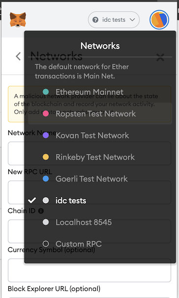
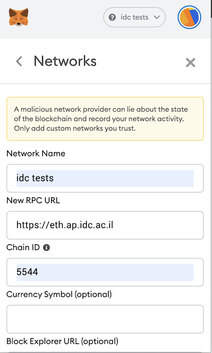

2. `git clone https://Daniel.Meller@vcs.ap.idc.ac.il/blockchain/project/201639663_038198149_finalProject`
3. `cd blockchain`
4. `docker build -t blockchain:v0.0.1 .`
5. `docker run -p 80:80 blockchain:v0.0.1`
6. In the browser, simply type `localhost`. you should see the following screen:

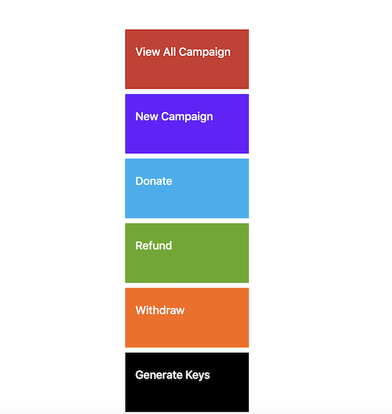

<br><br>

<h2><b>Your options:</b></h2>
1. View All Campaigns
2. New Campaign
3. Donate
4. Refund
5. Withdraw
6. Generate Keys

* In all the screens except the last one ("generate keys"), the action may take a minute to complete.
No, "please stand by" was used. you will just have to trust us. you will get an alert at the end of each action.
If the action ended good or bad.

<h4><b>1. View All Campaigns:</b></h4>
You will be asked to confirm a small amount of gas to be used for each of the campaigns the servers holds.
The operation may take up to a minute. 
In the end you should see all the contracts and their status, as can be seen in the image below:<br>

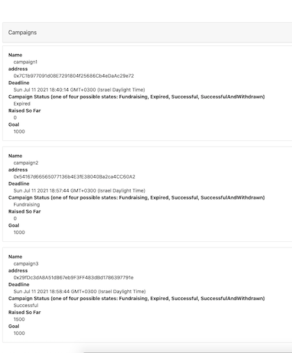

<br><br>
<h4><b>2. New Campaign:</b></h4>
Enter a campaign name, 3 accounts of "campaign owners", goal to achieve and amount of days it should be active 
and press "submit".
The operation may take up to a minute. 

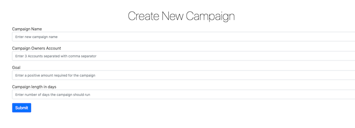

<br><br>
<h4><b>3. Donate:</b></h4>
This screen is for someone who wants to become a campaign contributors.
Enter campaign you want to donate to, enter amount and press "submit".
The operation may take up to a minute. 

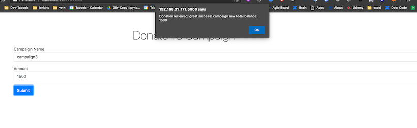

<br><br>
<h4><b>4. Refund:</b></h4>
This screen is for campaign contributors who want to get their money back.
Enter campaign you want to get your money back from.
The operation may take up to a minute. 

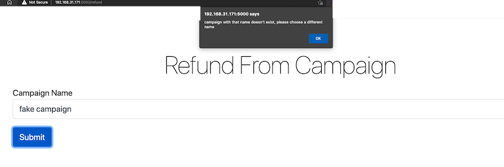

<br><br>
<h4><b>5. Withdraw:</b></h4>
This screen is for campaign owners who want to withdraw the funds from the campaign. 
When a campaign finished successfully.
The operation may take up to a minute.

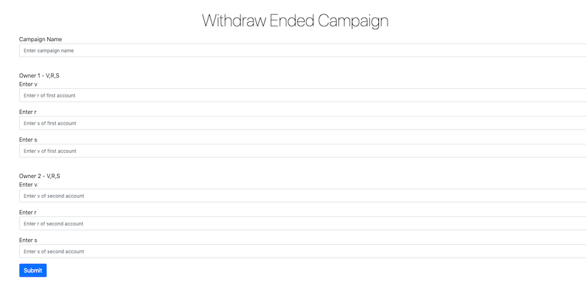

<br><br>
<h4><b>6. Generate Keys:</b></h4>
This is a utility screen, not intended to be used by the public. it's to assist in generate private
keys.
For simplicity I used a fixed phrase and hashed it. it's only meant to demonstrate capabilities and 
shouldn't be used like this in the real world.
The fixed phrase is: "fixed phrase"

Below you can see images of where to get the private key, and how it looks when you use it in
this screen.
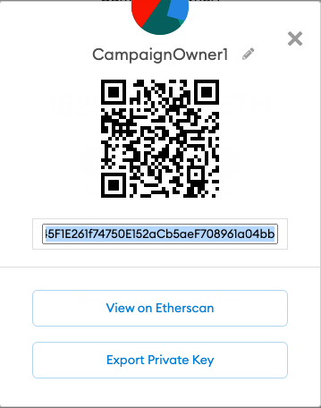
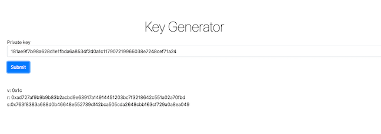

<br><br><br>
<h2><b>How It Works:</b></h2>
Below you can see a design diagram of the all system.

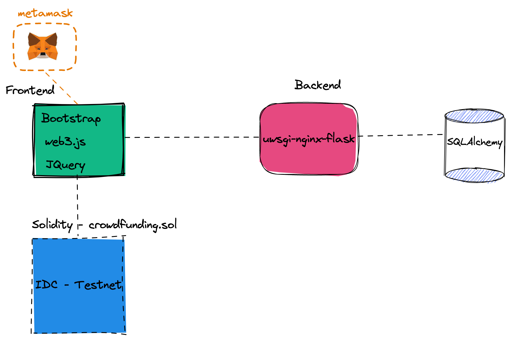

When you Click "New Campaign", fill the details and press submit. you are first going through a validation
process to make sure that the campaign name you chose is a unique one.
It's important because, using that name people will know to contribute to your campaign.

When you click submit. a new contract is created, you will be asked to pay for the gas it will cost to 
Submit it. a pop-up screen of metamask should appear and ask for your approval. 

When you click except, the system will attemp to create a new contract with the goal, expiration date and
and the three account owners you added. 
The title will not be sent for gas-cost saving reasons.

Upon a success indication from the Testnet, the backend server of the site will receive instruction to 
store the information on the campaign. 

The information stored on the server is minimal, for security reasons. and only include the address received from 
The server and the name of the campaign. 
As can be seen below.
```
class Campaign(db.Model):
    address = db.Column(db.String(120), primary_key=True)
    title = db.Column(db.String(120), unique=True, nullable=False)

    def __repr__(self):
        return f'<Campaign title:{self.title} address:{self.address}>'
```